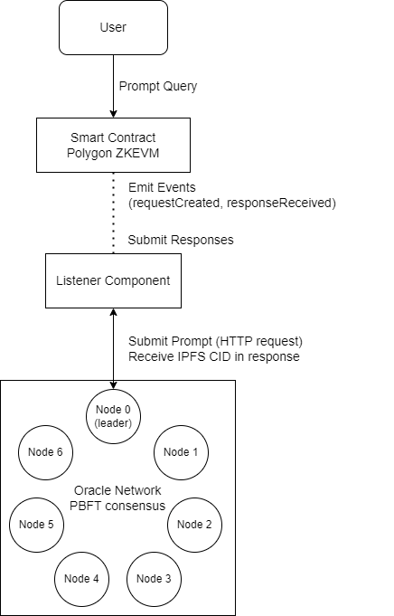

# Ethereum LLM Oracle Network

A decentralized oracle network enabling Ethereum smart contracts to securely interact with Large Language Models (LLMs).

## How to run on local machine
- `config\config.json` contains the configuration and API keys
- Start the oracle
    - `cd <project root>`
    - `go build .\oracle\cmd\server\`
    - Run `server.exe --config config\config.json` or `server --config config\config.json`
    - The oracle will start listening on port 8080
- Start the listener
    - `cd <project root>`
    - `cd scripts`
    - `go run main.go`
    - The listener will start looking for events on the Polygon ZKEVM testnet
- Initiate a transaction with Prompt
    - `cd <project root>`
    - `cd scripts`
    - `go run caller.go --prompt "Tell me a short story about northeastern"`
    - The caller will initiate a transaction with the prompt and wait for the response
    - The response will be stored to IPFS and also printed to the console
- View Testnet transactions and events: [Link](https://cardona-zkevm.polygonscan.com/address/0x7a340e95CC98776Ba1746D466C70A0f064be1008)

## Overview

This project implements a decentralized oracle network that bridges the gap between deterministic blockchain smart contracts and non-deterministic Large Language Models. Built on the Polygon ZKEVM testnet, the system uses a Practical Byzantine Fault Tolerance (PBFT) consensus mechanism to handle LLM outputs reliably and securely.
## Architecture

The system architecture consists of multiple oracle nodes that work together to process requests from smart contracts, interact with LLMs, and reach consensus on responses.

Each oracle node independently processes the same request, and the network uses PBFT consensus to agree on the final response that gets stored on IPFS and referenced on-chain.

## Key Features

- **Decentralized Oracle Network**: 7-node network with PBFT consensus
- **Smart Contract Integration**: Solidity contracts for query submission and response handling
- **IPFS Storage**: Efficient off-chain storage with on-chain hash references
- **Response Validation**: Semantic similarity scoring using cosine similarity
- **Docker Support**: Containerized oracle nodes for easy deployment
- **Error Handling**: Robust fallback mechanisms for node failures
